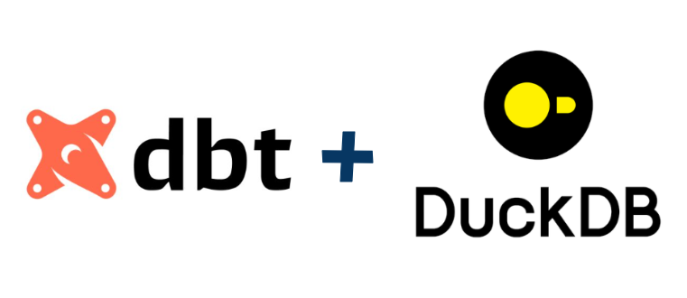

## Workshop03: DuckDB e DBT




### Onde estamos?
Conseguimos ter os nossos dados da API, banco SQL e EXCEL em nosso Data Lake. Mas como transformar esses dados em valor para o negócio?

### Objetivo 
Este repositório contém a segunda parte do projeto Workshop03, que demonstra o uso do DuckDB em conjunto com o DBT para análise de dados. O projeto é ideal para aqueles que estão buscando integrar DuckDB com ferramentas modernas de transformação de dados.

Precisamos responder:

- Qual a loja com receita venda?
- Quais sas 5 lojas com mais e com menos venda?
- Quais 10 produtos tiveram a maior receita?

## Documentação

Mkdocs: [Github-Pages](https://lvgalvao.github.io/W03_duckdb_dbt/)


## Pré-requisitos

Antes de começar, certifique-se de ter os seguintes pré-requisitos instalados em seu sistema:

- Git
- Python (recomendado 3.11.5: usar pyenv para gerenciamento de versões)
- Poetry para gerenciamento de dependências Python


### Como instalar?

Pré requisitos - Esse projeto utiliza o [DataProjectStarterKit](https://github.com/lvgalvao/DataProjectStarterKit) como base

## Instalação

Siga estas etapas para instalar e configurar o projeto em seu ambiente local:

### Clonando o Repositório

Clone o repositório para sua máquina local usando o seguinte comando:

```bash
git clone git@github.com:lvgalvao/W03_duckdb_dbt.git
cd W03_duckdb_dbt
```

### Configurando o Ambiente Python

Se estiver usando `pyenv`, configure a versão local do Python para o projeto:

```bash
pyenv install 3.11.5  # Substitua com a versão específica necessária para o projeto
pyenv local 3.11.5
```

### Instalando Dependências

Instale as dependências do projeto usando Poetry:

```bash
poetry shell
poetry env use 3.11.5
poetry install
```

Isso instalará todas as dependências listadas no arquivo `pyproject.toml`.

Teste executando o comando

```
bash
duckdb
```

## Documentação

Mkdocs: [Github-Pages](https://lvgalvao.github.io/Workshop03_duckdb_dbt/)

## Uso

Depois de instalar, você pode começar a usar o projeto. (Aqui, você pode adicionar instruções específicas sobre como executar scripts ou comandos relevantes para o projeto.)
