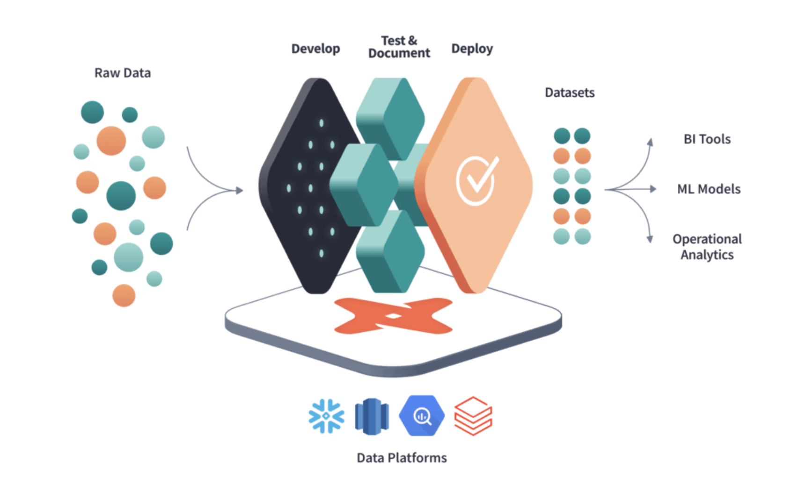

# dbt-core: Transformação de Dados para Engenharia de Dados

## Introdução

A ferramenta dbt (data build tool) é uma solução inovadora no campo da engenharia de dados, projetada para conectar-se a repositórios de dados centralizados como Data Warehouses e Data Lakes. Ela habilita usuários de negócios, analistas e engenheiros a gerar transformações de dados, regras de negócios e insights valiosos de forma autônoma e eficiente.




## O que é dbt?

O dbt é uma ferramenta focada na transformação de dados dentro de um pipeline de ETL/ELT, onde ETL significa Extrair, Transformar e Carregar. Ele se concentra especificamente no aspecto de Transformação (T), permitindo a criação de fluxos de trabalho de transformação de dados usando SQL.

## Origem e Evolução

Criado em 2016 para endereçar desafios de unidade e orquestração em SQL, o dbt ganhou tração com a popularização de Data Warehouses em cloud como Redshift, BigQuery, Azure Synapse e Snowflake. Seu desenvolvimento foi impulsionado tanto pela equipe original quanto por uma vibrante comunidade de código aberto.

## Princípios Fundamentais do dbt

### SQL para Desenvolvimento Rápido

O dbt utiliza SQL, juntamente com a linguagem de templates Jinja, permitindo a reutilização e modularização do código SQL.

### Controle de Versão e Trabalho Colaborativo

Com integração Git, o dbt facilita a colaboração e o controle de versões, essencial para pipelines de dados robustos e confiáveis.

### Qualidade e Testes

O dbt suporta integração e entrega contínuas, juntamente com testes automatizados, garantindo a integridade e a eficácia das transformações de dados.

### Documentação e Linhagem de Dados

A documentação é gerada automaticamente, proporcionando uma visão clara da linhagem dos dados e facilitando a rastreabilidade e a compreensão das transformações.

## Estrutura de um Projeto dbt

### Arquivos Principais

* `dbt_project.yml`: Define as configurações do projeto dbt.
* `profiles.yml`: Contém credenciais e perfis para conexões com Data Warehouses.

### Componentes de um Projeto

* **Projeto**: Um diretório contendo arquivos `.sql` e `.yml`.
* **Modelo**: Arquivos `.sql` com instruções `SELECT`, formando a base das transformações.
* **Comandos**: Instruções `dbt` para executar tarefas específicas.

## Como é a configuração padrão do dbt-core


[Imagens retiradas da internet](https://www.youtube.com/watch?v=asxGh2TrNyI&t=442s)

Desvantagens dessa arquitetura padrão

- Não aproveita o seu computador ($$$)
- Você sempre precisa ligar o seu DW para tudo ($$$)
- Dificuldade de realizar testes unitários
- Curva de aprendizado maior
  
## Proposta de arquitetura dbt-core com duckdb


Como o duckdb roda local, conseguimos remover a figura do DW para aproveitar nossa máquina para o ciclo de desenvolvimento e testes. 

A conexão com o duckdb é igual a qualquer outro conector

[Lista de conectores dbt](https://docs.getdbt.com/docs/connect-adapters)

## Instalação

```bash
poetry add dbt-duckdb
```