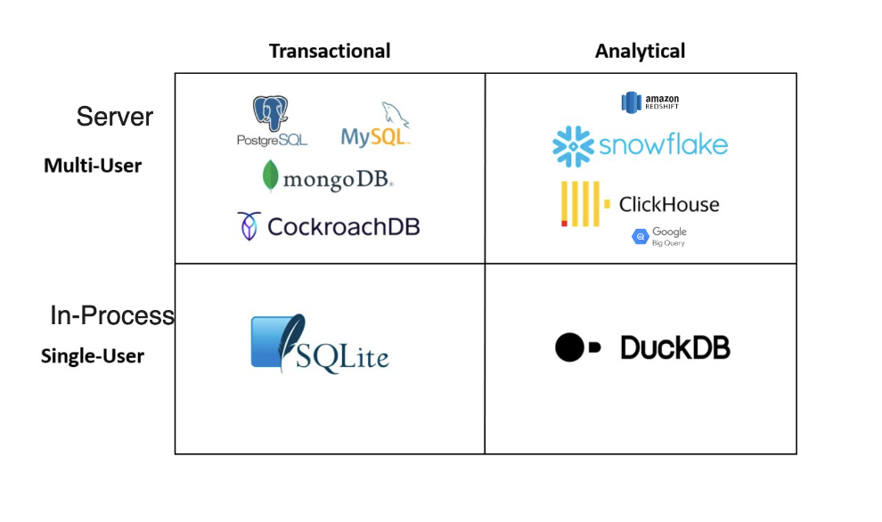
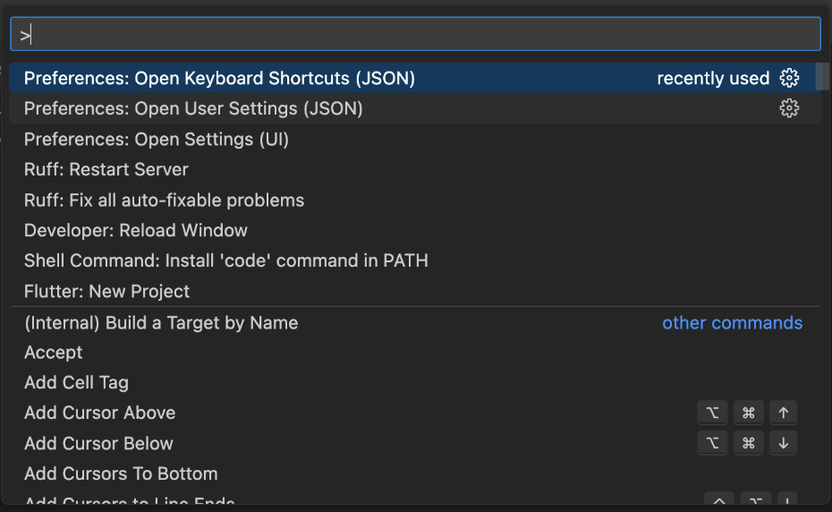
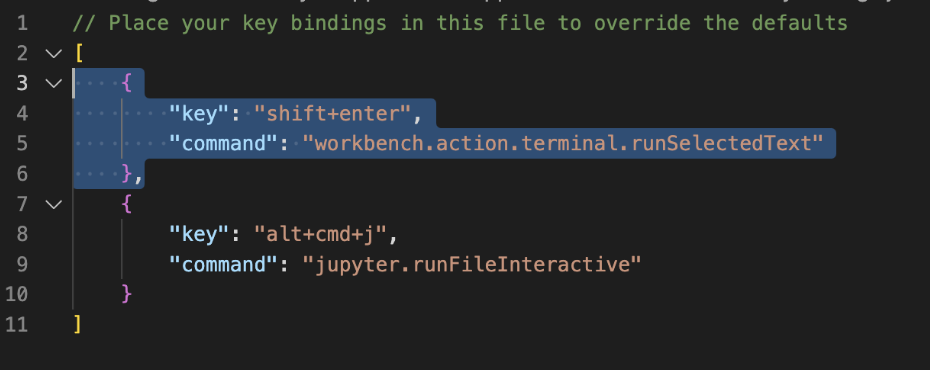
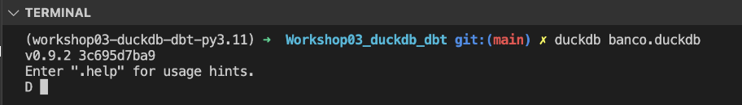

# duckdb

Em nossa rotina temos que trabalhar muitas vezes consumindo; arquivos csv, parquet e outros formatos, e muitas vezes essa atividade não é tão simples, estão muitas vezes na AWS, Azure, etc. 

O duckdb hoje é a forma mais eficiente para se trabalhar com:

- Múltiplos arquivos
- Quem é muito bom em SQL (compatibilidade de código)
- Quem gosta de Python, R ou Java
- Quem usa Pandas ou Polars
- Quem precisa de performance
- Quem quer aproveitar hardware local
- Utilizar um In process OLAP DBMS, Columnar database e com processamento vetorial 
  


**É o SQLite do Analytics**

[Como instalar o duckdb?](https://duckdb.org/docs/archive/0.9.1/installation/index?undefined=macos)

```bash
poetry add duckdb
```


## Como utilizá-lo com o vscode?

Acessar o `Open Keyboard Shortcuts (JSON)`



Incluir esse atalha, dessa forma sempre que selecionarmos determinado texto e apertarmos `shift+enter ` ele irá rodar esse código no terminal



Vamos brincar um pouco


- Fazer o Exercício 01

Vamos criar nossa primeira tabela /o/
Por ele rodar in-processo, ao sairmos do programa perdemos os dados

Exemplo: Persistindo os dados ao iniciar o CLI



Alguns pontos importantes sobre o formato duckdb

- 1 arquivo único (todas as tabelas ficam no mesmo arquivo)
  
- Suporta update
- Armazenada no formato colunar

## Exercicio 01

Criar uma tabela genérica

```sql
SHOW tables; 

CREATE TABLE transacoes (
    id INT,
    usuario_id INT,
    valor DECIMAL(10, 2),
    data_transacao DATE
);

SHOW tables; 

INSERT INTO transacoes (id, usuario_id, valor, data_transacao) VALUES
(1, 1, 100.00, '2024-01-01'),
(2, 2, 200.00, '2024-01-01'),
(3, 1, 150.00, '2024-01-02'),
(4, NULL, 120.00, '2024-01-02'), -- Usuário NULL
(5, 2, 130.00, '2024-01-03'),
(6, NULL, 110.00, '2024-01-03'), -- Usuário NULL
(7, 1, 160.00, '2024-01-04'),
(8, 2, 100.00, '2024-01-04');

SELECT usuario_id, SUM(valor) AS total
FROM transacoes
GROUP BY usuario_id;

ALTER TABLE transacoes
ADD tipo_transacao VARCHAR(10);

SELECT * FROM transacoes;

ALTER TABLE transacoes
ADD categoria VARCHAR(20);

SELECT * FROM transacoes;

-- DELETE FROM transacoes;

CREATE TEMPORARY TABLE backup_transacoes AS SELECT * FROM transacoes;

select * from backup_transacoes;

DELETE FROM transacoes;

SELECT * FROM transacoes;

INSERT INTO transacoes (id, usuario_id, valor, data_transacao, tipo_transacao, categoria) VALUES
(1, 1, 100.00, '2024-01-01', 'compra', 'eletronicos'),
(2, 2, 200.00, '2024-01-01', 'venda', 'livros'),
(3, 1, 150.00, '2024-01-02', 'compra', 'vestuario'),
(4, 3, 120.00, '2024-01-02', 'compra', 'alimentacao'),
(5, 2, 130.00, '2024-01-03', 'venda', 'eletronicos'),
(6, 3, 110.00, '2024-01-03', 'compra', 'livros'),
(7, 1, 160.00, '2024-01-04', 'venda', 'alimentacao'),
(8, 2, 100.00, '2024-01-04', 'compra', 'vestuario');

SELECT * FROM transacoes;

.exit
```